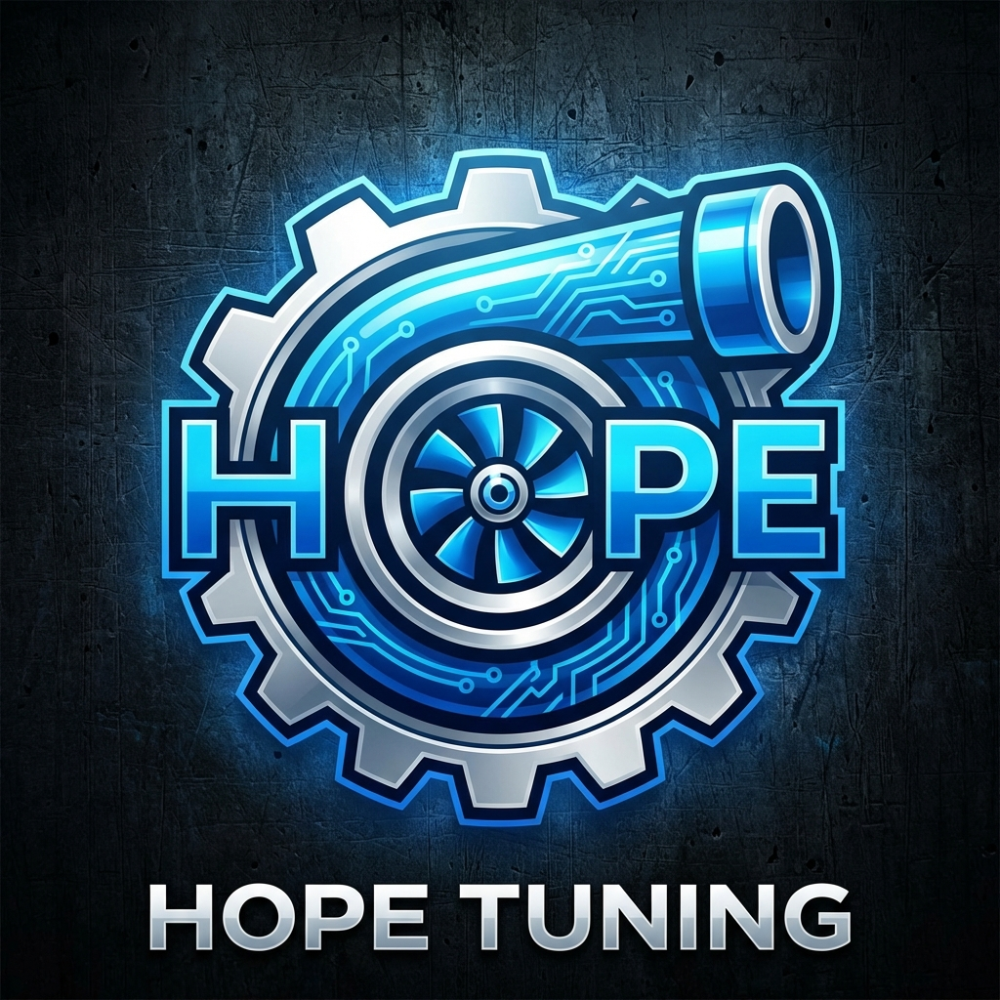
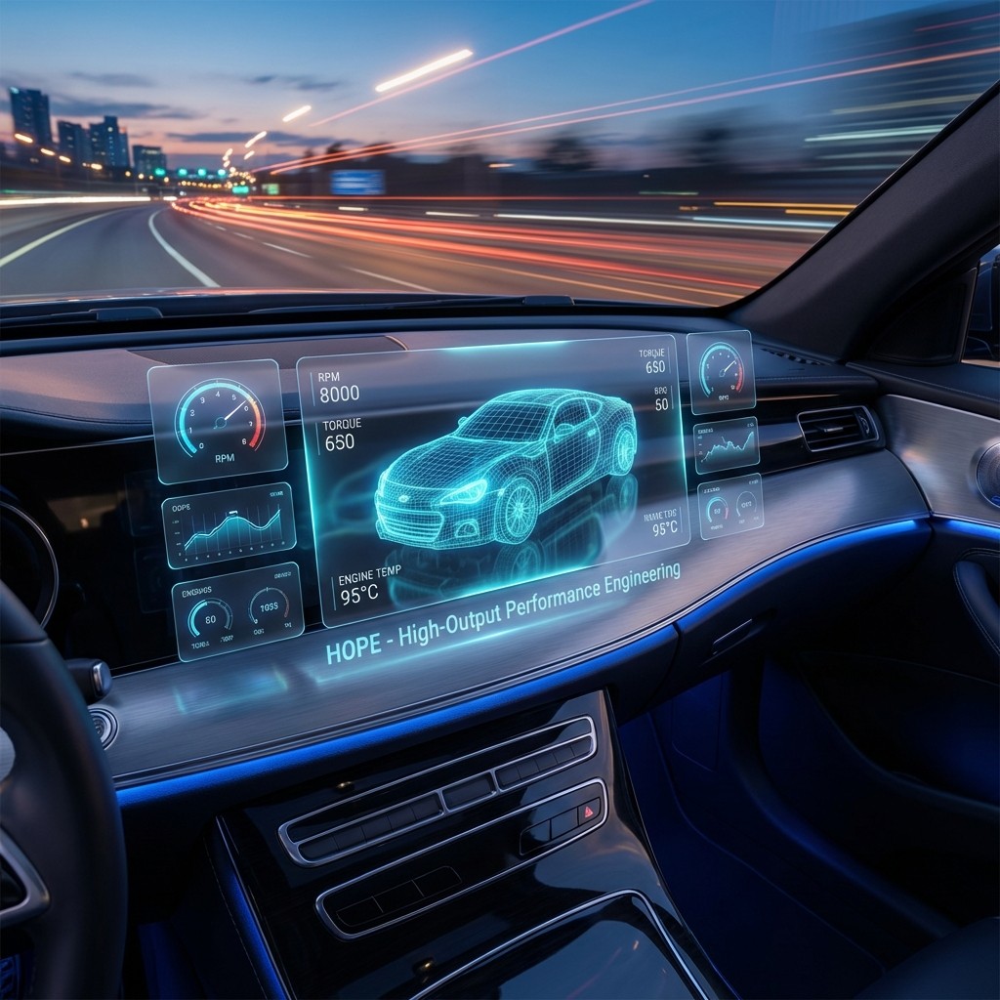

# HOPE - High-Output Performance Engineering

<div align="center">



**Next-Generation AI-Driven Vehicle Diagnostics, ECU Tuning & Digital Twin Platform**

[](https://dotnet.microsoft.com/)
[](https://nodejs.org/)
[](https://www.python.org/)
[](https://nextjs.org/)
[](LICENSE)

**[Website](https://hope-tuning.com)** • **[Documentation](https://docs.hope-tuning.com)** • **[HOPE Central](https://central.hope-tuning.com)** • **[Community](https://discord.gg/hope-tuning)**

</div>

---

## 🚗 Overview

**HOPE** is an enterprise-grade, AI-powered automotive engineering platform designed for professional tuning shops, performance workshops, and fleet operators. The system integrates real-time vehicle diagnostics, safe ECU calibration management, explainable AI-driven anomaly detection, genetic algorithm-based tuning optimization, and a complete digital twin simulation environment.

HOPE bridges the gap between traditional scan tools and cutting-edge machine learning, providing technicians with predictive insights, customers with plain-English reports, and tuners with a secure marketplace to monetize their work.

---

## ✨ Key Features

### 🔌 Core Diagnostics & Communication
| Feature | Description |
|---------|-------------|
| **High-Frequency OBD2 Streaming** | 10-50Hz data ingestion via ELM327 or J2534 Pass-Thru interfaces |
| **Professional Gauges** | Real-time visualization with LiveCharts2 (RPM, Boost, AFR, Knock, etc.) |
| **Multi-Protocol Support** | KWP2000, UDS (ISO 14229), CAN bus (ISO 15765), J1850 |
| **Bi-Directional Control** | Active actuator testing (fuel pump, fans, injectors) with safety interlocks |
| **Voltage-Aware HAL** | Monitors battery voltage via J2534 `READ_VBATT`; blocks write operations below 12.5V |

### ⚙️ ECU Calibration & Tuning
| Feature | Description |
|---------|-------------|
| **Version-Controlled Calibrations** | Git-like history for ECU binaries with checksum validation |
| **Graphical Map Diff Tool** | 3D surface comparison of fuel, ignition, and boost maps |
| **Safe-Mode ECU Flashing** | Pre-flight checks, shadow backup, and multi-step flash protocol |
| **Intelligent Tuning Optimizer** | Genetic algorithm engine that evolves VE tables to hit target AFR |
| **Map-Switching** | Multiple tune profiles (Economy, Performance, Valet) in a single flash |
| **Master/Slave Marketplace** | AES-256 encrypted, hardware-locked calibration file sales |

### 🧠 Artificial Intelligence & Analytics
| Feature | Description |
|---------|-------------|
| **LSTM Anomaly Detection** | Autoencoder identifies sensor drift before DTC triggers |
| **Explainable AI (XAI)** | "Diagnostic Narratives" and "Ghost Curves" explain why anomalies were flagged |
| **Physics-Informed Neural Networks (PINNs)** | Virtual sensors estimate EGT and other non-instrumented metrics |
| **Predictive Maintenance (RUL)** | Remaining Useful Life forecasting for catalysts, O2 sensors, turbos |
| **Generative AI Reports** | LLM translates DTCs and performance data into customer-friendly PDFs |

### 🎨 User Experience (HMI)
| Feature | Description |
|---------|-------------|
| **Contextual Focus Modes** | Dynamic UI: WOT mode shows only AFR/Knock; Cruise mode shows economy |
| **Dark Mode / Glassmorphism** | Modern, high-contrast interface optimized for shop environments |
| **Mobile Companion App** | (Planned) Customer-facing iOS/Android app for live vehicle status |

### ☁️ Infrastructure & Ecosystem
| Feature | Description |
|---------|-------------|
| **Offline-First Architecture** | SQLite (WAL mode) with CRDT-based cloud sync for conflict-free merging |
| **Cryptographic Audit Trails** | Immutable, hash-chained logs of every ECU modification for legal compliance |
| **Wiki-Fix Community Database** | Stack-Overflow style knowledge base linking repairs to diagnostic patterns |
| **Carbon Credit Verification** | B2B fuel savings quantification for Eco-Tuning certification |

### 🎮 Simulation & Digital Twin
| Feature | Description |
|---------|-------------|
| **BeamNG.drive Integration** | Bidirectional data bridge for "In-Silico" tune validation |
| **Automation Engine Export** | Import engine designs for virtual dyno testing |
| **Virtual Pre-Flight Validation** | Test tunes for thermal stress and mechanical failure in simulation before flashing |

### 🌐 HOPE Central (Cloud Platform)
| Feature | Description |
|---------|-------------|
| **Digital Experience Platform (DXP)** | Next.js web portal with SSO (OAuth2/OIDC) |
| **Calibration Marketplace** | Secure B2B/B2C exchange with license generation and hardware locking |
| **Wiki-Fix Knowledge Graph** | NLP-indexed forum with machine-readable DTC database |
| **Fleet Health Dashboard** | Real-time status of all connected vehicles across shops |

---

## 🏗️ Architecture

```
┌───────────────────────────────────────────────────────────────────────────────┐
│                           HOPE Desktop (Windows 11)                           │
│  ┌─────────────────┐ ┌─────────────────┐ ┌─────────────────┐ ┌──────────────┐ │
│  │  OBD2 Service   │ │  ECU Calibration│ │  AI Inference   │ │  Simulation  │ │
│  │  (ELM327/J2534) │ │  (Flash/Diff)   │ │  (ONNX Runtime) │ │  (BeamNG)    │ │
│  └────────┬────────┘ └────────┬────────┘ └────────┬────────┘ └──────┬───────┘ │
│           │                   │                   │                 │         │
│           └───────────────────┴───────────────────┴─────────────────┘         │
│                                       │                                        │
│                          ┌────────────┴───────────┐                           │
│                          │  Voltage-Aware HAL     │                           │
│                          │  (Safety Interlocks)   │                           │
│                          └────────────┬───────────┘                           │
└───────────────────────────────────────┼───────────────────────────────────────┘
                                        │ GraphQL / WebSocket
                                        ▼
┌───────────────────────────────────────────────────────────────────────────────┐
│                        Cloud Backend (NestJS + PostgreSQL)                    │
│  ┌─────────────┐ ┌─────────────┐ ┌─────────────┐ ┌─────────────┐ ┌──────────┐ │
│  │    Auth     │ │  Vehicles   │ │ Diagnostics │ │ Marketplace │ │ Wiki-Fix │ │
│  │  (JWT/SSO)  │ │  (Fleet)    │ │ (Sessions)  │ │  (Tunes)    │ │ (NLP/KB) │ │
│  └─────────────┘ └─────────────┘ └─────────────┘ └─────────────┘ └──────────┘ │
│                                       │                                        │
│  ┌─────────────────────────────────────────────────────────────────────────┐  │
│  │  PostgreSQL + TimescaleDB  │  Neo4j (Knowledge Graph)  │  AWS S3 (ECU)  │  │
│  └─────────────────────────────────────────────────────────────────────────┘  │
└───────────────────────────────────────────────────────────────────────────────┘
                                        │
                                        ▼
┌───────────────────────────────────────────────────────────────────────────────┐
│                         HOPE Central (Next.js Web Portal)                     │
│  ┌─────────────┐ ┌─────────────┐ ┌─────────────┐ ┌─────────────────────────┐  │
│  │  Marketing  │ │  Dashboard  │ │   Forum     │ │  Tune Marketplace       │  │
│  │  (Landing)  │ │  (Fleet)    │ │ (Wiki-Fix)  │ │  (Buy/Sell Calibrations)│  │
│  └─────────────┘ └─────────────┘ └─────────────┘ └─────────────────────────┘  │
└───────────────────────────────────────────────────────────────────────────────┘
```

---

## 🔧 Technology Stack

| Layer | Technologies |
|-------|-------------|
| **Desktop Application** | .NET 8 WPF (MVVM + Prism), LiveCharts2, ONNX Runtime, SQLite |
| **Hardware Interfaces** | J2534 Pass-Thru API, ELM327 serial, CAN bus |
| **Backend API** | Node.js 20, NestJS, GraphQL (Apollo), PostgreSQL 16, TimescaleDB, Neo4j |
| **AI/ML Pipeline** | Python 3.11, PyTorch, TensorFlow, Genetic Algorithms, ONNX export |
| **Web Portal** | Next.js 14, React, Apollo Client, Tailwind CSS |
| **Simulation** | BeamNG.drive Lua API, Automation game engine |
| **Security** | AES-256-GCM, JWT, OAuth2/OIDC, TLS 1.3 |
| **Infrastructure** | Docker, Terraform, AWS (S3, RDS, CloudFront) |

---

## 🚀 Quick Start

### Prerequisites

- [.NET 8 SDK](https://dotnet.microsoft.com/download/dotnet/8.0)
- [Node.js 20 LTS](https://nodejs.org/)
- [Python 3.11](https://www.python.org/downloads/)
- [PostgreSQL 16](https://www.postgresql.org/download/) + [TimescaleDB](https://www.timescale.com/)
- [Docker Desktop](https://www.docker.com/products/docker-desktop) (recommended)
- [Visual Studio 2022](https://visualstudio.microsoft.com/) (for desktop development)
- **Hardware:** ELM327 OBD2 adapter (basic) or J2534 Pass-Thru device (professional)

### Installation

```powershell
# 1. Clone the repository
git clone https://github.com/freduardo4/H.O.P.E.git
cd H.O.P.E

# 2. Run the setup script
.\scripts\setup-dev.ps1

# 3. Install Python dependencies
cd src\ai-training
.\venv\Scripts\Activate.ps1
pip install -r requirements.txt

# 4. Start the backend
cd ..\backend
npm install
npm run start:dev

# 5. Open desktop app in Visual Studio
# Open src\desktop\HOPE.Desktop.sln → Build and Run (F5)
```

---

## 📁 Project Structure

```
HOPE/
├── src/
│   ├── desktop/                    # .NET 8 WPF Desktop Application
│   │   ├── HOPE.Core/              # Business logic (hardware-independent)
│   │   │   ├── Hardware/           # J2534 adapter, voltage monitor
│   │   │   ├── Interfaces/         # IHardwareAdapter, IEcuService
│   │   │   ├── Models/             # Data models, DTOs
│   │   │   ├── Protocols/          # KWP2000, UDS implementations
│   │   │   └── Services/
│   │   │       ├── AI/             # ONNX inference, XAI narratives
│   │   │       ├── Audit/          # Cryptographic audit trails
│   │   │       ├── BiDirectional/  # Actuator control with safety
│   │   │       ├── Cloud/          # Sync service, CRDT merge
│   │   │       ├── Database/       # SQLite, session recording
│   │   │       ├── ECU/            # Calibration repo, safe flash
│   │   │       ├── Export/         # PDF reports
│   │   │       ├── OBD/            # OBD2 streaming
│   │   │       ├── Simulation/     # BeamNG bridge
│   │   │       └── UI/             # Focus modes
│   │   ├── HOPE.Desktop/           # WPF UI layer
│   │   │   ├── Controls/           # GaugeControl, MapDiffViewer
│   │   │   ├── Views/              # XAML views
│   │   │   └── ViewModels/         # MVVM view models
│   │   └── HOPE.Desktop.Tests/     # Unit tests
│   │
│   ├── backend/                    # NestJS Backend API
│   │   └── src/modules/
│   │       ├── auth/               # JWT, OAuth2 SSO
│   │       ├── customers/          # Customer management
│   │       ├── diagnostics/        # Session management
│   │       ├── ecu-calibrations/   # ECU file storage, versioning
│   │       ├── marketplace/        # Tune marketplace
│   │       ├── reports/            # PDF generation
│   │       ├── vehicles/           # Fleet management
│   │       └── wiki-fix/           # Knowledge graph, NLP
│   │
│   ├── ai-training/                # Python ML Pipeline
│   │   ├── models/                 # LSTM, PINN architectures
│   │   └── scripts/
│   │       ├── train_anomaly_detector.py
│   │       ├── genetic_optimizer.py
│   │       ├── pinn_virtual_sensor.py
│   │       └── rul_forecaster.py
│   │
│   ├── hope-central/               # Next.js Web Portal
│   │   ├── app/
│   │   │   ├── (marketing)/        # Landing pages
│   │   │   ├── (dashboard)/        # User portal, fleet health
│   │   │   ├── (forum)/            # Wiki-Fix discussions
│   │   │   └── (marketplace)/      # Tune store
│   │   └── lib/
│   │       ├── auth/               # OAuth2/OIDC client
│   │       └── graphql/            # Apollo Client
│   │
│   └── simulation/                 # Simulation Integration
│       └── beamng_mod/             # Lua mod for BeamNG.drive
│
├── infrastructure/
│   ├── docker/                     # Docker Compose for local dev
│   └── terraform/                  # AWS infrastructure as code
│
├── scripts/
│   ├── setup-dev.ps1               # Development environment setup
│   └── deploy.ps1                  # Production deployment
│
└── docs/
    ├── architecture/               # System design documents
    ├── protocols/                  # OBD2/ECU protocol guides
    └── deployment/                 # Deployment guides
```

---

## 🎯 Roadmap

### Phase 1: Core Diagnostics ✅
- [x] Project structure and architecture
- [x] ELM327 connection and live data streaming
- [x] Real-time gauges (RPM, Speed, Load, Temps)
- [x] Session recording to SQLite
- [ ] J2534 Pass-Thru support
- [ ] Bi-directional control with safety interlocks
- [ ] Voltage-aware HAL

### Phase 2: ECU Calibration & Tuning 🔄
- [x] KWP2000/UDS protocol implementation
- [x] Read ECU calibration files
- [ ] Version-controlled calibration repository
- [ ] Graphical map diff tool
- [ ] Safe-mode ECU flashing
- [ ] Genetic algorithm tuning optimizer
- [ ] Map-switching implementation
- [ ] Master/Slave marketplace

### Phase 3: AI & Analytics 🔄
- [x] Train LSTM Autoencoder
- [x] ONNX model export
- [ ] Explainable AI (XAI) narratives
- [ ] Physics-Informed Neural Networks (PINNs)
- [ ] Predictive Maintenance (RUL)
- [ ] Generative AI customer reports

### Phase 4: Infrastructure 🔲
- [ ] CRDT-based offline sync
- [ ] Cryptographic audit trails
- [ ] Wiki-Fix community database
- [ ] Carbon credit verification

### Phase 5: Simulation & Digital Twin 🔲
- [ ] BeamNG.drive integration
- [ ] Automation engine export
- [ ] Virtual pre-flight validation

### Phase 6: HOPE Central 🔲
- [ ] Next.js DXP portal
- [ ] Calibration marketplace
- [ ] Wiki-Fix knowledge graph
- [ ] Fleet health dashboard

---

## 📊 AI Model Details

### Anomaly Detection (LSTM Autoencoder)

```
Input: 10 OBD2 parameters × 60 timesteps (60 seconds @ 1 Hz)
  ↓
LSTM Encoder (64 units) → Latent Space (16 dim) → LSTM Decoder (64 units)
  ↓
Reconstruction Error → Anomaly Score → XAI Narrative
```

**Performance Targets:**
- Accuracy: >85%
- False Positive Rate: <10%
- Inference Latency: <50ms (CPU)

### Intelligent Tuning Optimizer (Genetic Algorithm)

```
Population: 50 candidate VE tables
  ↓
Fitness Function: Minimize |Actual AFR - Target AFR|
  ↓
Selection → Crossover → Mutation
  ↓
Evolve over N generations → Optimized calibration
```

---

## 🔒 Security & Compliance

| Area | Implementation |
|------|----------------|
| **Encryption** | AES-256-GCM at rest, TLS 1.3 in transit |
| **Authentication** | JWT with refresh tokens, OAuth2/OIDC SSO |
| **Authorization** | Role-based access control (RBAC) |
| **Audit Logging** | Immutable, hash-chained cryptographic logs |
| **Data Isolation** | Schema-per-shop multi-tenancy |
| **Hardware Locking** | Calibration files bound to J2534 serial or VIN |
| **Compliance** | GDPR-ready (data export/deletion) |

---

## 🛠️ Development

### Desktop App (WPF)

```powershell
cd src/desktop
dotnet restore
dotnet build
dotnet run --project HOPE.Desktop
dotnet test HOPE.Desktop.Tests
```

### Backend API (NestJS)

```bash
cd src/backend
npm install
npm run start:dev    # Development with hot-reload
npm run build        # Production build
npm test             # Run tests
```

### AI Training (Python)

```bash
cd src/ai-training
python -m venv venv
.\venv\Scripts\Activate.ps1  # Windows
pip install -r requirements.txt
python scripts/train_anomaly_detector.py
pytest
```

### Web Portal (Next.js)

```bash
cd src/hope-central
npm install
npm run dev          # Development server
npm run build        # Production build
```

---

## 🤝 Contributing

Contributions are welcome! Please read [CONTRIBUTING.md](CONTRIBUTING.md) for details on our code of conduct and the process for submitting pull requests.

### Development Workflow

1. Fork the repository
2. Create a feature branch (`git checkout -b feature/amazing-feature`)
3. Commit your changes (`git commit -m 'Add amazing feature'`)
4. Push to the branch (`git push origin feature/amazing-feature`)
5. Open a Pull Request

---

## 📝 License

This project is licensed under the MIT License - see the [LICENSE](LICENSE) file for details.

---

## 🙏 Acknowledgments

- **LiveCharts2** - Real-time charting (MIT license)
- **NestJS** - Backend framework
- **PyTorch / TensorFlow** - AI/ML frameworks
- **TimescaleDB** - Time-series database
- **BeamNG.drive** - Physics simulation engine
- **Automation** - Engine design game

---

## 📞 Support

| Channel | Link |
|---------|------|
| 📧 Email | support@hope-tuning.com |
| 💬 Discord | [HOPE Community](https://discord.gg/hope-tuning) |
| 📖 Documentation | [docs.hope-tuning.com](https://docs.hope-tuning.com) |
| 🐛 Bug Reports | [GitHub Issues](https://github.com/freduardo4/H.O.P.E/issues) |
| 🌐 HOPE Central | [central.hope-tuning.com](https://central.hope-tuning.com) |

---

<div align="center">

**Built with ❤️ for the automotive tuning community**

*Empowering technicians with AI. Protecting vehicles with safety-first engineering.*



</div>
