# H.O.P.E. (High-Output Performance Engineering)

## Overview

H.O.P.E. is an advanced, AI-powered vehicle diagnostics and ECU calibration platform. It bridges the gap between traditional tuning tools and modern predictive maintenance using machine learning.

## Quick Start

### Prerequisites
- .NET 8.0 SDK
- Node.js 20.x
- Python 3.10+
- PostgreSQL

## 🚀 Onboarding Journey

```mermaid
graph LR
    A["⚙️ Setup"] --> B["🔌 Connect"]
    B --> C["🔍 Diagnose"]
    C --> D["📈 Optimize"]
    D --> E["⚡ Flash"]
    
    style A fill:#4a90e2,stroke:#333,stroke-width:2px
    style E fill:#e94e77,stroke:#333,stroke-width:2px
```

> [!TIP]
> New to H.O.P.E? Follow our [Onboarding Guide](docs/ONBOARDING.md) to go from zero to your first diagnostic session in 5 minutes.

## 📊 System Health & Status

| Module | Status | Health | Integration |
| :--- | :--- | :--- | :--- |
| **Backend API** | ✅ Stable | ⚡ 24ms latency | RDS/S3 Connected |
| **Desktop Client** | ✅ Stable | 🛠️ J2534 Ready | Local DB Ready |
| **AI Forecaster** | ✅ Trained | 🎯 94% Accuracy | ONNX Verified |
| **Infrastructure** | ✅ Secure | 🛡️ tfsec Passed | Multi-Zone |

## Project Status

- **Status**: ✅ All core components verified.
- **Diagnostics**: UDS/KWP2000 protocol handlers implemented and tested.
- **Safety**: Voltage-aware HAL and simulated hardware integration complete.
- **AI**: LSTM Anomaly Detection pipeline functional with 96% test coverage.
- **Security**: Mandatory S3 encryption, public access blocks, and ECR scanning enabled.
- **Tests**: 440+ automated tests passing across Desktop, Backend, and AI.

## Documentation & Recipes

- **[Developer Recipes](recipes/README.md)**: Living examples for common tasks (OBD sessions, tuning, AI).
- **[Full Documentation](docs/README_full.md)**: Detailed architecture and deep dives.
- **[Documentation Index](docs/index.md)**: Navigation for all project docs.
- **[Contributing](CONTRIBUTING.md)**: How to get involved.

## License

See [LICENSE](LICENSE) file.
