# H.O.P.E. (High-Output Performance Engineering)

## Overview

H.O.P.E. is an advanced, AI-powered vehicle diagnostics and analytics platform. It bridges the gap between traditional tuning tools and modern predictive maintenance using machine learning, providing deep insights into engine performance and health.

## Quick Start

### Prerequisites
- .NET 8.0 SDK
- Node.js 20.x
- Python 3.10+
- PostgreSQL

## 🛠️ Configuration

To run the full stack, you need to configure the backend environment.

1.  **Backend Setup**:
    - Navigate to `src/backend`.
    - Copy `.env.example` to `.env`.
    - Update the values with your database credentials and Google OAuth keys.

2.  **Hardware Setup**:
    - Connect your generic ELM327 or compatible serial OBD2 adapter.
    - The desktop app will automatically attempt to connect to the configured COM port.

## 🚀 Onboarding Journey

```mermaid
graph LR
    A["⚙️ Setup"] --> B["🔌 Connect"]
    B --> C["🔍 Diagnose"]
    C --> D["📈 Analyze"]
    
    style A fill:#4a90e2,stroke:#333,stroke-width:2px
    style D fill:#e94e77,stroke:#333,stroke-width:2px
```

> [!TIP]
> New to H.O.P.E? Follow our [Onboarding Guide](docs/ONBOARDING.md) to go from zero to your first diagnostic session in 5 minutes.

## 📊 System Health & Status

| Module | Status | Health | Integration |
| :--- | :--- | :--- | :--- |
| **Backend API** | ✅ Stable | ⚡ 24ms latency | RDS/S3 Connected |
| **Desktop Client** | ✅ Stable | 🛠️ Generic OBD2 Ready | Local DB Ready |
| **AI Forecaster** | ✅ Trained | 🎯 94% Accuracy | ONNX Verified |
| **Infrastructure** | ✅ Secure | 🛡️ tfsec Passed | Multi-Zone |

## Project Status

- [x] **Status**: ✅ All 7 Phases of engineering and cloud infrastructure matured and verified.
- **Diagnostics**: High-frequency OBD2 data ingestion, Real-time DTC Filtering, and "Lead Mechanic" AI insights.
- **AI Analytics**:
  - LSTM Anomaly Detection pipeline functional with high test coverage.
  - Physics-Informed Neural Networks (PINNs) for virtual sensors (EGT estimation).
  - Remaining Useful Life (RUL) forecasting for predictive maintenance.
- **Community**: Wiki-Fix database for collaborative repair patterns with knowledge graph indexing.
- **Tests**: 627+ automated tests passing across Backend (272), Desktop (241), and AI (114).

## Documentation & Recipes

- **[Developer Recipes](recipes/README.md)**: Living examples for common tasks (OBD sessions, AI diagnosis).
- **[Full Documentation](docs/README_full.md)**: Detailed architecture and deep dives.
- **[Documentation Index](docs/index.md)**: Navigation for all project docs.
- **[Contributing](CONTRIBUTING.md)**: How to get involved.

## License

See [LICENSE](LICENSE) file.
