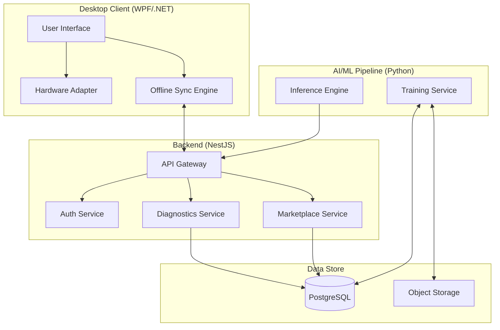

# System Architecture

```mermaid
graph TD
    subgraph "Desktop Client (WPF/.NET)"
        UI[User Interface]
        HA[Hardware Adapter]
        OfflineSync[Offline Sync Engine]
    end

    subgraph "Backend (NestJS)"
        API[API Gateway]
        Auth[Auth Service]
        Diag[Diagnostics Service]
        Market[Marketplace Service]
    end

    subgraph "AI/ML Pipeline (Python)"
        Train[Training Service]
        Inference[Inference Engine]
    end

    subgraph "Data Store"
        PG[(PostgreSQL)]
        S3[Object Storage]
    end

    UI --> HA
    UI --> OfflineSync
    OfflineSync <--> API
    
    API --> Auth
    API --> Diag
    API --> Market
    
    Diag --> PG
    Market --> PG
    
    Train <--> PG
    Train <--> S3
    
    Inference --> API
```
