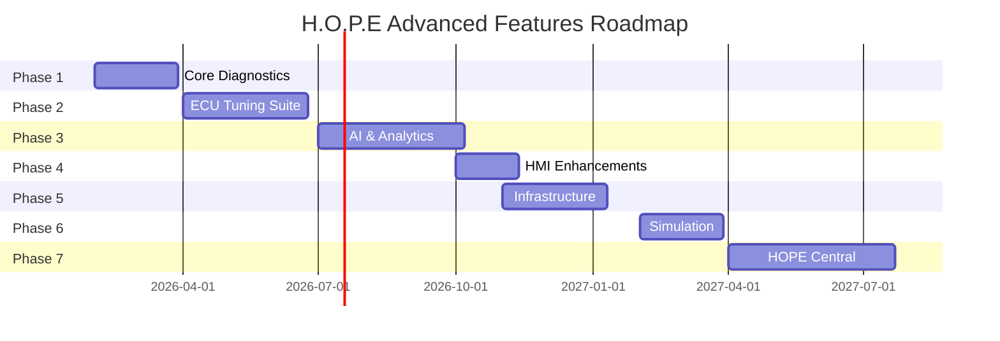

# H.O.P.E Advanced Features Implementation Plan

Comprehensive implementation of advanced automotive diagnostics, ECU tuning, AI analytics, cloud ecosystem, and simulation features. **Excludes:** DoIP/ISO 13400 and Security Gateway (SGW) as requested.

---

## User Review Required

> [!IMPORTANT]
> **This is an enterprise-scale roadmap.** The features span 7 phases with an estimated 18-36 months of development. Please confirm:
> 1. **Priority order** - Which phases should be implemented first?
> 2. **Hardware requirements** - Do you have access to J2534 devices for testing?
> 3. **Cloud infrastructure** - AWS/GCP/Azure preference for HOPE Central?
> 4. **BeamNG licensing** - Do you have access to BeamNG.drive modding tools?

> [!WARNING]
> **Bi-Directional Control and ECU Flashing** are safety-critical features that could damage vehicles if implemented incorrectly. Professional automotive testing equipment and controlled environments are required.

---

## Phase 1: Core Diagnostics & Communication

**Timeline: 6-8 weeks | Complexity: High**

### 1.1 Real-time OBD2 Diagnostics Enhancement [COMPLETED]

Extended high-frequency data streaming with professional hardware support.

---

#### [MODIFY] [Obd2Service.cs](file:///c:/Users/Test/Documents/H.O.P.E/src/desktop/HOPE.Core/Services/OBD/Obd2Service.cs)

- Add `HighFrequencyMode` property for 10-50Hz sampling
- Implement `IObservable<OBD2Frame>` for reactive data streaming
- Add connection abstraction to support both ELM327 and J2534

---

#### [NEW] [IHardwareAdapter.cs](file:///c:/Users/Test/Documents/H.O.P.E/src/desktop/HOPE.Core/Interfaces/IHardwareAdapter.cs)

```csharp
public interface IHardwareAdapter : IDisposable
{
    Task<bool> ConnectAsync(string port, int baudRate);
    Task<byte[]> SendMessageAsync(byte[] data, CancellationToken ct);
    IObservable<byte[]> StreamMessages();
    HardwareType Type { get; } // ELM327, J2534, Mock
    bool SupportsHighFrequency { get; }
}
```

---

#### [NEW] [J2534Adapter.cs](file:///c:/Users/Test/Documents/H.O.P.E/src/desktop/HOPE.Core/Hardware/J2534Adapter.cs)

J2534 Pass-Thru implementation using Windows DLL interop:

- `PassThruOpen`, `PassThruConnect`, `PassThruReadMsgs`, `PassThruWriteMsgs`
- Support for ISO15765 (CAN), ISO14230 (KWP2000), J1850
- Hardware-level timing control for deterministic communication

---

#### [NEW] [GaugeControl.xaml](file:///c:/Users/Test/Documents/H.O.P.E/src/desktop/HOPE.Desktop/Controls/GaugeControl.xaml)

Professional radial gauge with:
- Configurable min/max/warning zones
- Smooth needle animation (60fps)
- Digital readout overlay

---

### 1.2 Bi-Directional Control [COMPLETED]

Active testing and actuator control via UDS Service 0x2F.

---

#### [NEW] [BiDirectionalService.cs](file:///c:/Users/Test/Documents/H.O.P.E/src/desktop/HOPE.Core/Services/BiDirectional/BiDirectionalService.cs)

```csharp
public class BiDirectionalService
{
    public Task<ActuatorResponse> ControlActuatorAsync(
        ActuatorCommand cmd,
        VehicleState currentState);
    
    public bool ValidateSafetyConditions(ActuatorCommand cmd, VehicleState state);
}
```

**Safety Interlock System:**
```
┌─────────────────────────────────────────────────────────────────┐
│  [User Request] → [Safety Validator] → [ECU Command]           │
│                         │                                       │
│              ┌──────────┴──────────┐                            │
│              ▼                     ▼                            │
│      [ALLOW if:]            [BLOCK if:]                         │
│      • Engine OFF            • Vehicle moving                   │
│      • Gear = PARK           • Battery < 12.5V                  │
│      • Battery OK            • No J2534 connected               │
│      • J2534 present                                            │
└─────────────────────────────────────────────────────────────────┘
```

---

#### [NEW] [ActuatorCommand.cs](file:///c:/Users/Test/Documents/H.O.P.E/src/desktop/HOPE.Core/Models/ActuatorCommand.cs)

- Command types: `FuelPump`, `CoolingFan`, `Injector`, `Solenoid`, `ThrottleBody`
- Duration limits (max 5 seconds per activation)
- Required preconditions per command type

---

### 1.3 Voltage-Aware Hardware Abstraction Layer (HAL) [COMPLETED]

---

#### [NEW] [VoltageMonitor.cs](file:///c:/Users/Test/Documents/H.O.P.E/src/desktop/HOPE.Core/Hardware/VoltageMonitor.cs)

```csharp
public class VoltageMonitor
{
    private const double SAFE_THRESHOLD = 12.5;
    private const double CRITICAL_THRESHOLD = 11.5;
    
    public async Task<VoltageStatus> ReadBatteryVoltageAsync();
    public bool IsWriteOperationSafe => CurrentVoltage >= SAFE_THRESHOLD;
    public IObservable<VoltageWarning> VoltageAlerts { get; }
}
```

Uses J2534 `READ_VBATT` IOCTL to monitor real-time battery voltage.

---


### 1.4 Robust Connectivity & Hardware Versatility

---

#### [NEW] [BenchControlService.cs](file:///c:/Users/Test/Documents/H.O.P.E/src/desktop/HOPE.Core/Services/Hardware/BenchControlService.cs)

Service to manage bench mode operations (Direct-to-pin, Scanmatik).

```csharp
public interface IBenchPowerSupply
{
    Task<bool> SetIgnitionAsync(bool on, CancellationToken ct = default);
    Task<bool> SetPowerAsync(bool on, CancellationToken ct = default);
}
```

- **Scanmatik Support**: Maps `SetIgnition` to J2534 `SetProgrammingVoltage` (Pin 12) or specific Aux pins.
- **Safety**: Interlocks to prevent power-off during critical operations.

---

#### [NEW] [FlightRecorderService.cs](file:///c:/Users/Test/Documents/H.O.P.E/src/desktop/HOPE.Core/Services/Diagnostics/FlightRecorderService.cs)

Circular buffer CAN logging ("Black Box") for post-incident analysis.

- **Circular Buffer**: Stores last 10,000 frames in memory.
- **Auto-Dump**: Writes to disk on `HardwareError` or manual trigger.
- **Format**: PCAP or raw CSV export.

#### [NEW] Security & Hardware ID Abstraction
- **Abstract GetHardwareId**: Refactor `CryptoService` to bind to a logical ID rather than raw hardware string.
- **Migration Mode**: Graceful fallback allowing database re-encryption with a master password on hardware change.

#### [NEW] Advanced Communication & Service Refactoring
- **Service Refactoring**: Clearly separate `CloudSafetyService`, `J2534Adapter`, and `SafeFlashService` for testability.
- **Unit Tests**: Add tests around safety limits (invalid tuning values, rollback behavior).
- **Integration Tests**: Full-stack OBD communication flow tests using `SimulatedHardwareAdapter`.
- **Hardware-in-the-Loop (HiL)**: Simulations for deterministic protocol timing.

---

## Phase 2: ECU Calibration & Tuning

**Timeline: 8-12 weeks | Complexity: Very High**


### 2.1 ECU Calibration Management [IN PROGRESS]

---

#### [NEW] [MultiViewEditor.xaml](file:///c:/Users/Test/Documents/H.O.P.E/src/desktop/HOPE.Desktop/Views/MultiViewEditor.xaml)

Integrated editor with multiple perspectives:
- **3D Surface**: Existing Viewport3D enhanced with interaction.
- **Tabular**: DataGrid for precise cell editing with heatmap coloring.
- **2D Chart**: Line graph (Cross-section) for row/column analysis.
- **Hex View**: Raw binary inspection using `WpfHexEditorControl`.

#### [NEW] [AxisEditor.xaml](file:///c:/Users/Test/Documents/H.O.P.E/src/desktop/HOPE.Desktop/Views/AxisEditor.xaml)

Dialog for rescaling map axes (e.g., changing RPM breakpoints).
- Re-interpolates map data to fit new axis points (Linear/Cubic Spline).
- Validates monotonicity of axis values.

#### [MODIFY] [CalibrationRepository.cs](file:///c:/Users/Test/Documents/H.O.P.E/src/desktop/HOPE.Core/Services/ECU/CalibrationRepository.cs)
- Add `InterpolateMap` utility for axis rescaling.

---

### 2.2 Safe-Mode ECU Flashing [COMPLETED]

---

#### [NEW] [SafeFlashService.cs](file:///c:/Users/Test/Documents/H.O.P.E/src/desktop/HOPE.Core/Services/ECU/SafeFlashService.cs)

Multi-step flash protocol:

```
┌─ Pre-Flight Checks ─────────────────────────────────────────────┐
│ 1. Battery voltage ≥ 13.0V (engine running or charger)         │
│ 2. J2534 connection latency < 50ms                              │
│ 3. ECU responding to diagnostic session                         │
│ 4. No active DTCs that could interrupt flash                    │
└─────────────────────────────────────────────────────────────────┘
                              │
                              ▼
┌─ Shadow Backup (Restore Point) ─────────────────────────────────┐
│ 1. Full ECU read → encrypted local backup                       │
│ 2. Checksum verification of backup                              │
│ 3. Store backup metadata in cloud (for recovery)                │
└─────────────────────────────────────────────────────────────────┘
                              │
                              ▼
┌─ Flash Execution ───────────────────────────────────────────────┐
│ 1. Enter programming session (UDS 0x10 0x02)                    │
│ 2. Security access (UDS 0x27)                                   │
│ 3. Write blocks with progress tracking                          │
│ 4. Verify each block before proceeding                          │
│ 5. Exit session and hard reset ECU                              │
└─────────────────────────────────────────────────────────────────┘
                              │
                              ▼
┌─ Recovery Mode (Brick Protection) ─────────────────────────────┐
│ 1. Automated "Wake-up" sequence for non-responsive ECUs        │
│ 2. Forced bootloader entry via TesterPresent (0x3E) flood      │
│ 3. Checksum-bypass restore for corrupted flash headers         │
└─────────────────────────────────────────────────────────────────┘

---

#### [NEW] [Formal Verification (TLA+)](file:///c:/Users/Test/Documents/H.O.P.E/docs/specs/SafeFlash.tla)

Formal specification of the ECU Flash State Machine to ensure safety properties:
- **Liveness**: Flash eventually completes or reverts to backup.
- **Safety**: ECU never enters "Dead" state without recovery path.
- **Transactional**: Writes are atomic per block.

```tla
--------------------------- MODULE SafeFlash ---------------------------
EXTENDS Integers, Sequences, TLC

VARIABLES 
    ecu_state,      \* {Default, Programming, Bricked}
    flash_progress, \* 0..100
    backup_exists   \* BOOLEAN

TypeOK == 
    /\ ecu_state \in {"Default", "Programming", "Bricked"}
    /\ flash_progress \in 0..100
    /\ backup_exists \in BOOLEAN
...
```

---

#### [MODIFY] [SafeFlashService.cs](file:///c:/Users/Test/Documents/H.O.P.E/src/desktop/HOPE.Core/Services/ECU/SafeFlashService.cs)

- Implement `TryEmergencyRecoveryAsync()`
- Add `TesterPresent` background task during flash to keep session alive
- Refactor `FlashAsync` into a discrete state machine for better observability and verification.

```

---

### 2.3 Intelligent Tuning Optimizer

---

#### [NEW] [genetic_optimizer.py](file:///c:/Users/Test/Documents/H.O.P.E/src/ai-training/scripts/genetic_optimizer.py)

Genetic Algorithm for n-dimensional map optimization (VE, Ign, AFR).

#### [NEW] [map_classifier.py](file:///c:/Users/Test/Documents/H.O.P.E/src/ai-training/hope_ai/tuning/map_classifier.py)

AI Pattern Recognition to automatically label maps:
- Features: Gradient analysis, statistical moments, value range mapping.
- Categories: VE Volumetric Efficiency, Ignition Timing, Target AFR, Boost Target.

#### [NEW] [tuning_auditor.py](file:///c:/Users/Test/Documents/H.O.P.E/src/ai-training/hope_ai/tuning/tuning_auditor.py)

Logic Conflict Warnings (AI Pre-flight Safety):
- **Smoothness Audit**: Detects non-linear spikes that cause fuel lean-out or knock.
- **Limit Audit**: Cross-references AFR targets against load to prevent engine melt-down.
- **Monotonicity Check**: Ensures ignition curves follow physical laws.

#### [NEW] [rl_guided_optimizer.py](file:///c:/Users/Test/Documents/H.O.P.E/src/ai-training/hope_ai/tuning/rl_guided_optimizer.py)

RL-Enhanced GA Hybrid:
- Uses a Reinforcement Learning agent to dynamically adjust `mutation_rate` and `mutation_strength` based on population diversity and convergence speed.
- Implements "Emissions Guardrail" as a mandatory policy constraint during evolution.


---

### 2.4 Map-Switching Implementation

---

#### [NEW] [MapSwitchProfile.cs](file:///c:/Users/Test/Documents/H.O.P.E/src/desktop/HOPE.Core/Models/MapSwitchProfile.cs)

Multi-tune profile management:

- Economy mode (lean cruise, reduced boost)
- Performance mode (aggressive timing, peak boost)
- Anti-theft mode (rev limiter at 2000 RPM, no boost)
- Valet mode (speed limiter, reduced power)

Toggle via physical input (cruise control stalk pattern) or mobile app.

---

### 2.5 Master/Slave File Marketplace

---

#### [NEW] Marketplace Module (Backend + Desktop)

```
src/backend/src/modules/marketplace/
├── marketplace.module.ts
├── marketplace.service.ts        # AES-256 encryption/decryption
├── marketplace.resolver.ts       # GraphQL API
├── entities/
│   ├── calibration-listing.entity.ts
│   └── license.entity.ts
└── dto/
    ├── create-listing.dto.ts
    └── purchase.dto.ts
```

**Security Architecture:**
- Files encrypted with AES-256-GCM before upload
- Key derivation from hardware ID (J2534 serial or VIN)
- License server validates device binding on each flash attempt

---

## Phase 3: AI & Analytics

**Timeline: 10-14 weeks | Complexity: Very High**

### 3.1 LSTM Anomaly Detection Enhancement [COMPLETED]

---

#### [MODIFY] [train_anomaly_detector.py](file:///c:/Users/Test/Documents/H.O.P.E/src/ai-training/scripts/train_anomaly_detector.py)

- Add reconstruction error threshold auto-tuning
- Implement model versioning with MLflow
- Export enhanced ONNX with anomaly score output

---

### 3.2 Explainable AI (XAI) / Glass-Box Diagnostics [COMPLETED]

---

#### [NEW] [ExplainableAnomalyService.cs](file:///c:/Users/Test/Documents/H.O.P.E/src/desktop/HOPE.Core/Services/AI/ExplainableAnomalyService.cs)

**Diagnostic Narratives:**
```
"MAF sensor reading 15% below expected for current RPM and throttle position.
 This pattern typically indicates: vacuum leak, dirty MAF sensor, or intake restriction.
 Confidence: 87% | Historical matches: 234 similar cases"
```

**Ghost Curves Visualization:**
```
Expected MAF (based on VE table): ─────────
Actual MAF (from sensor):         ─ ─ ─ ─ ─
                                      ↑
                                  Deviation Zone
```

---

### 3.3 Physics-Informed Neural Networks (PINNs) [COMPLETED]

---

#### [NEW] [pinn_virtual_sensor.py](file:///c:/Users/Test/Documents/H.O.P.E/src/ai-training/scripts/pinn_virtual_sensor.py)

Virtual EGT estimation using thermodynamic constraints:

```python
class PINNVirtualSensor:
    def __init__(self):
        self.model = self._build_pinn()
    
    def _physics_loss(self, inputs, outputs):
        """Enforce Q = m * Cp * dT in loss function."""
        mass_flow = inputs['maf']
        delta_t = outputs['egt'] - inputs['coolant_temp']
        # Energy balance constraint
        return mse(predicted_heat, actual_heat_proxy)
```

---

- **Turbo shaft play (boost stability variance)**

### 3.5 AI/ML Ops & Maintainability [NEW]

- **Centralized Dependencies**: Provide a single `requirements.txt` or `pyproject.toml` for all Python components.
- **Standardized Config**: Move JSON configs to `src/ai-training/configs/` with shared schemas.
- **CLI Entrypoint**: Unified script for training, evaluation, and ONNX export.
- **Regression Tests**: Pytest tests to run fixture batches through ONNX models and verify accuracy thresholds.
- **Model Traceability**: MLflow/DVC for versioning, and standardized Model Cards (documentation).
- **Explainability**: SHAP/LIME integration for diagnostic narratives.
- **Documentation**: Create `docs/ai-pipeline.md` covering ingestion, training, and export.

---

#### [NEW] [rul_forecaster.py](file:///c:/Users/Test/Documents/H.O.P.E/src/ai-training/scripts/rul_forecaster.py)

Time-series forecasting for component life:

- Catalytic converter efficiency degradation
- Spark plug wear (misfire rate trend)
- Oxygen sensor response time drift
- Turbo shaft play (boost stability variance)

---

## Phase 4: User Experience (HMI)

**Timeline: 4-6 weeks | Complexity: Medium**

### 4.1 Contextual Focus Modes

---

#### [NEW] [FocusModeService.cs](file:///c:/Users/Test/Documents/H.O.P.E/src/desktop/HOPE.Core/Services/UI/FocusModeService.cs)

Dynamic UI reconfiguration based on vehicle state:

| Mode | Trigger | Display |
|------|---------|---------|
| **Idle** | RPM < 1000 | Full dashboard |
| **Cruise** | Steady speed | Economy metrics |
| **WOT** | Throttle > 90% | AFR, Knock, Boost only (high-contrast) |
| **Diagnostic** | Manual selection | DTC focus |

---

### 4.2 Generative AI "Plain English" Reporting

---

#### [NEW] [DiagnosticNarrativeService.cs](file:///c:/Users/Test/Documents/H.O.P.E/src/desktop/HOPE.Core/Services/AI/DiagnosticNarrativeService.cs)

LLM integration (local Ollama or cloud GPT-4):

```csharp
public async Task<CustomerReport> GenerateReportAsync(DiagnosticSession session)
{
    var prompt = BuildPrompt(session.DTCs, session.AnomalyScores, session.VehicleInfo);
    var narrative = await _llmService.GenerateAsync(prompt);
    return new CustomerReport
    {
        TechnicalSummary = session.RawData,
        CustomerSummary = narrative,  // "Your oxygen sensor is showing signs of wear..."
        RecommendedActions = ExtractActions(narrative)
    };
}

### 4.4 Desktop UI/UX & Robustness [NEW]

- **Service Refactoring**: Centralize business logic in services; lean ViewModels.
- **Navigation**: Centralize view switching using Prism's navigation framework.
- **Error Handling**: Graceful surfaces for connection loss and model failure using Correlation IDs.
- **UX Refinement**: Responsive map editors and DTC views with filtering/search and severity highlighting.
- **Auto-Updater**: Squirrel.Windows for seamless background client updates.
- **Crash Reporting**: Sentry.io integration for automatic error tracking.
- **UI Automation**: Appium/WinAppDriver for E2E desktop testing.
```

---

## Phase 5: Infrastructure & Ecosystem

**Timeline: 8-10 weeks | Complexity: High**

### 5.1 Offline-First Architecture with CRDTs

---

#### [MODIFY] [DatabaseService.cs](file:///c:/Users/Test/Documents/H.O.P.E/src/desktop/HOPE.Core/Services/Database/DatabaseService.cs)

- Enable SQLite WAL mode for concurrent reads during logging
- Implement Yjs-based CRDT sync for conflict-free merging

---

#### [NEW] [SyncService.cs](file:///c:/Users/Test/Documents/H.O.P.E/src/desktop/HOPE.Core/Services/Cloud/SyncService.cs)

```csharp
public class SyncService
{
    public async Task SyncToCloudAsync(bool forceFullSync = false);
    public async Task ResolveConflictsAsync(IEnumerable<ConflictedRecord> conflicts);
    public SyncStatus CurrentStatus { get; }
}
```

---

### 5.2 Cryptographic Audit Trails

---

#### [NEW] [AuditLogService.cs](file:///c:/Users/Test/Documents/H.O.P.E/src/desktop/HOPE.Core/Services/Audit/AuditLogService.cs)

Hash-chained immutable log (blockchain-lite):

```csharp
public class AuditEntry
{
    public Guid Id { get; }
    public DateTime Timestamp { get; }
    public string Action { get; }          // "ECU_WRITE", "DTC_CLEAR", etc.
    public string DataHash { get; }        // SHA-256 of payload
    public string PreviousHash { get; }    // Chain integrity
    public string Signature { get; }       // Shop private key signature
}
```

---

### 5.3 Wiki-Fix Community Database

---

#### [NEW] Wiki-Fix Backend Module

```
src/backend/src/modules/wiki-fix/
├── wiki-fix.module.ts
├── wiki-fix.service.ts
├── knowledge-graph.service.ts   # Neo4j integration
├── entities/
│   ├── repair-pattern.entity.ts
│   └── vote.entity.ts
└── resolvers/
    └── wiki-fix.resolver.ts
```

Stack-Overflow model with DTC linking and voting.

---

### 5.4 Backend Quality & API Governance [NEW]

- **Testing Coverage**: Jest tests for Security, Marketplace licensing, and Wiki-fix mutations.
- **Input Validation**: Enforce class-validator DTOs; avoid direct entity exposure in GraphQL.
- **Observability**: Standardized NestJS exception filters and Sentry/OpenTelemetry spans with metadata.
- **API Docs**: Publish OpenAPI/GraphQL schemas and create `docs/backend.md`.
- **Complete CI Pipeline**: Enable `next-build` and real Playwright E2E tests in `ci.yml`.
- **Environment Parity**: Synchronize Docker Compose configurations for dev/staging/prod.

### 5.5 Carbon Credit Verification

---

#### [NEW] [CarbonCreditService.cs](file:///c:/Users/Test/Documents/H.O.P.E/src/desktop/HOPE.Core/Services/Analytics/CarbonCreditService.cs)

```csharp
public class CarbonCreditService
{
    public FuelSavingsReport CalculateSavings(
        TuneProfile before, 
        TuneProfile after, 
        IEnumerable<DrivingSession> sessions);
    
    public CarbonCreditCertificate GenerateCertificate(FuelSavingsReport report);
}
```

---

## Phase 6: Simulation & Digital Twin

**Timeline: 6-8 weeks | Complexity: High**

### 6.1 BeamNG.drive / Automation Integration [COMPLETED]

---

#### [NEW] [SimulationBridge.cs](file:///c:/Users/Test/Documents/H.O.P.E/src/desktop/HOPE.Core/Services/Simulation/SimulationBridge.cs)

Bidirectional data bridge:

```
┌─────────────┐     JSON/WebSocket     ┌─────────────────────┐
│  HOPE App   │ ◄───────────────────► │  BeamNG.drive       │
│             │                        │  (Lua mod)          │
│  Tune       │  Export ECU params     │                     │
│  Candidate  │ ───────────────────►  │  Apply to vehicle   │
│             │                        │  Run simulation     │
│  Telemetry  │  ◄───────────────────  │  Collect results    │
│  Analysis   │  Thermal/stress/laptime│                     │
└─────────────┘                        └─────────────────────┘
```

---

#### [NEW] [beamng_mod/](file:///c:/Users/Test/Documents/H.O.P.E/src/simulation/beamng_mod/)

Lua mod for BeamNG.drive:
- WebSocket server for HOPE communication
- Apply tune parameters to Jbeam vehicle data
- [x] Stream telemetry (torque, thermal stress, crash g-forces)

### 6.2 Resilience & Chaos Engineering [NEW]

- **Fault Injection**: Randomly simulate adapter disconnects or high latency to test system resilience.
- **Resilient Recovery**: Verify automated restoration of diagnostic sessions after communication failure or data dropouts.

---

## Phase 7: Cloud Ecosystem (HOPE Central)

**Timeline: 12-16 weeks | Complexity: Very High**

### 7.1 Digital Experience Platform (DXP) [COMPLETED]

---

#### [NEW] [hope-central/](file:///c:/Users/Test/Documents/H.O.P.E/src/hope-central/)

Next.js web portal:

```
src/hope-central/
├── app/
│   ├── (marketing)/           # Landing pages
│   ├── (dashboard)/           # User portal
│   ├── (forum)/               # Wiki-Fix discussion
│   └── (marketplace)/         # Tune store
├── components/
├── lib/
│   ├── auth/                  # OAuth2/OIDC SSO
│   └── graphql/               # Apollo Client
└── next.config.js
```

---

### 7.2 Calibration Marketplace [COMPLETED]

Secure B2B/B2C exchange with license generation and hardware locking.

### 7.3-7.4 Knowledge Graph, Asset Management

Extensions to the backend modules created in Phases 2 and 5.


---

### 7.5 Web Portal (HOPE Central) Maturation [NEW]

- **Roadmap**: Define portal role (Admin/Customer/Marketplace) in `src/hope-central/README.md`.
- **End-to-End Pages**: Marketplace and Wiki-fix flows with full NestJS/OIDC Auth integration.
- **Design System**: Small system for buttons, cards, and tables for branding consistency.
- **Testing/Linting**: Playwright/Cypress smoke tests for login and core navigation.
- **Marketplace Governance**: KYC, revenue sharing, star ratings, and review systems.
- **Community Tools**: Data export (CSV/JSON) and vehicle profile management.
- **Load Testing**: Performance benchmarking for Marketplace and API concurrency.

---


### Automated Tests

**Desktop (.NET):**
```powershell
cd c:\Users\Test\Documents\H.O.P.E\src\desktop
dotnet test HOPE.Desktop.Tests --logger "console;verbosity=detailed"
```

Existing tests:
- [DatabaseServiceTests.cs](file:///c:/Users/Test/Documents/H.O.P.E/src/desktop/HOPE.Desktop.Tests/DatabaseServiceTests.cs)
- [OnnxAnomalyServiceTests.cs](file:///c:/Users/Test/Documents/H.O.P.E/src/desktop/HOPE.Desktop.Tests/OnnxAnomalyServiceTests.cs)
- [SafeFlashServiceTests.cs](file:///c:/Users/Test/Documents/H.O.P.E/src/desktop/HOPE.Desktop.Tests/SafeFlashServiceTests.cs)

New tests to add:
- `CloudSafetyServiceTests.cs` (mock HTTP)

**Backend (NestJS):**
```bash
cd c:\Users\Test\Documents\H.O.P.E/src/backend
npm test
```

**AI Training (Python):**
```bash
cd c:\Users\Test\Documents\H.O.P.E/src/ai-training
pytest -v
```

### Manual Verification

> [!CAUTION]
> **ECU flashing and bi-directional control MUST be tested on a bench ECU or junkyard vehicle first.** Never test write operations on a customer vehicle without prior validation.

1.  **J2534 Connection:** Connect J2534 device → Verify connection in HOPE → Read battery voltage
2.  **Gauge Visualization:** Stream live RPM data → Verify smooth gauge animation
3.  **Map Diff Tool:** Load two calibration files → Verify visual diff is accurate
4.  **AI Anomaly:** Inject synthetic anomaly → Verify detection and XAI narrative
5.  **Offline Sync:** Disconnect internet → Make changes → Reconnect → Verify CRDT merge
6.  **Cloud Safety Policy:**
    -   Attempt flash with correct voltage -> Verify Cloud logs success.
    -   Simulate low voltage -> Verify Cloud logs failure/attempt (if implemented to log attempts).
    -   Simulate Cloud "Deny" (mock) -> Verify Desktop aborts pre-flight.

---

## Estimated Timeline



---

## Technology Summary

| Layer | Technology |
|-------|------------|
| Desktop | .NET 8 WPF, LiveCharts2, ONNX Runtime |
| Hardware | J2534 API, ELM327 fallback |
| Backend | NestJS, PostgreSQL, TimescaleDB, Neo4j |
| AI/ML | PyTorch, TensorFlow, Genetic Algorithms |
| Web Portal | Next.js, Apollo Client, Headless CMS |
| Simulation | BeamNG.drive Lua API, Automation exports |
| Security | AES-256-GCM, JWT, OAuth2/OIDC |
