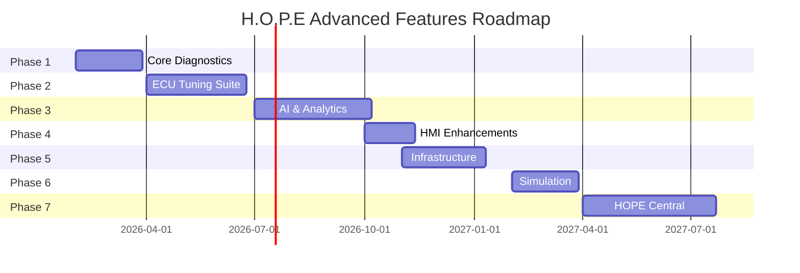

# H.O.P.E Advanced Features Implementation Plan

Comprehensive implementation of advanced automotive diagnostics, ECU tuning, AI analytics, cloud ecosystem, and simulation features. **Excludes:** DoIP/ISO 13400 and Security Gateway (SGW) as requested.

---

## User Review Required

> [!IMPORTANT]
> **This is an enterprise-scale roadmap.** The features span 7 phases with an estimated 18-36 months of development. Please confirm:
> 1. **Priority order** - Which phases should be implemented first?
> 2. **Hardware requirements** - Do you have access to J2534 devices for testing?
> 3. **Cloud infrastructure** - AWS/GCP/Azure preference for HOPE Central?
> 4. **BeamNG licensing** - Do you have access to BeamNG.drive modding tools?

> [!WARNING]
> **Bi-Directional Control and ECU Flashing** are safety-critical features that could damage vehicles if implemented incorrectly. Professional automotive testing equipment and controlled environments are required.

---

## Phase 1: Core Diagnostics & Communication

**Timeline: 6-8 weeks | Complexity: High**

### 1.1 Real-time OBD2 Diagnostics Enhancement [COMPLETED]

Extended high-frequency data streaming with professional hardware support.

---

#### [MODIFY] [Obd2Service.cs](file:///c:/Users/Test/Documents/H.O.P.E/src/desktop/HOPE.Core/Services/OBD/Obd2Service.cs)

- Add `HighFrequencyMode` property for 10-50Hz sampling
- Implement `IObservable<OBD2Frame>` for reactive data streaming
- Add connection abstraction to support both ELM327 and J2534

---

#### [NEW] [IHardwareAdapter.cs](file:///c:/Users/Test/Documents/H.O.P.E/src/desktop/HOPE.Core/Interfaces/IHardwareAdapter.cs)

```csharp
public interface IHardwareAdapter : IDisposable
{
    Task<bool> ConnectAsync(string port, int baudRate);
    Task<byte[]> SendMessageAsync(byte[] data, CancellationToken ct);
    IObservable<byte[]> StreamMessages();
    HardwareType Type { get; } // ELM327, J2534, Mock
    bool SupportsHighFrequency { get; }
}
```

---

#### [NEW] [J2534Adapter.cs](file:///c:/Users/Test/Documents/H.O.P.E/src/desktop/HOPE.Core/Hardware/J2534Adapter.cs)

J2534 Pass-Thru implementation using Windows DLL interop:

- `PassThruOpen`, `PassThruConnect`, `PassThruReadMsgs`, `PassThruWriteMsgs`
- Support for ISO15765 (CAN), ISO14230 (KWP2000), J1850
- Hardware-level timing control for deterministic communication

---

#### [NEW] [GaugeControl.xaml](file:///c:/Users/Test/Documents/H.O.P.E/src/desktop/HOPE.Desktop/Controls/GaugeControl.xaml)

Professional radial gauge with:
- Configurable min/max/warning zones
- Smooth needle animation (60fps)
- Digital readout overlay

---

### 1.2 Bi-Directional Control [COMPLETED]

Active testing and actuator control via UDS Service 0x2F.

---

#### [NEW] [BiDirectionalService.cs](file:///c:/Users/Test/Documents/H.O.P.E/src/desktop/HOPE.Core/Services/BiDirectional/BiDirectionalService.cs)

```csharp
public class BiDirectionalService
{
    public Task<ActuatorResponse> ControlActuatorAsync(
        ActuatorCommand cmd,
        VehicleState currentState);
    
    public bool ValidateSafetyConditions(ActuatorCommand cmd, VehicleState state);
}
```

**Safety Interlock System:**
```
┌─────────────────────────────────────────────────────────────────┐
│  [User Request] → [Safety Validator] → [ECU Command]           │
│                         │                                       │
│              ┌──────────┴──────────┐                            │
│              ▼                     ▼                            │
│      [ALLOW if:]            [BLOCK if:]                         │
│      • Engine OFF            • Vehicle moving                   │
│      • Gear = PARK           • Battery < 12.5V                  │
│      • Battery OK            • No J2534 connected               │
│      • J2534 present                                            │
└─────────────────────────────────────────────────────────────────┘
```

---

#### [NEW] [ActuatorCommand.cs](file:///c:/Users/Test/Documents/H.O.P.E/src/desktop/HOPE.Core/Models/ActuatorCommand.cs)

- Command types: `FuelPump`, `CoolingFan`, `Injector`, `Solenoid`, `ThrottleBody`
- Duration limits (max 5 seconds per activation)
- Required preconditions per command type

---

### 1.3 Voltage-Aware Hardware Abstraction Layer (HAL) [COMPLETED]

---

#### [NEW] [VoltageMonitor.cs](file:///c:/Users/Test/Documents/H.O.P.E/src/desktop/HOPE.Core/Hardware/VoltageMonitor.cs)

```csharp
public class VoltageMonitor
{
    private const double SAFE_THRESHOLD = 12.5;
    private const double CRITICAL_THRESHOLD = 11.5;
    
    public async Task<VoltageStatus> ReadBatteryVoltageAsync();
    public bool IsWriteOperationSafe => CurrentVoltage >= SAFE_THRESHOLD;
    public IObservable<VoltageWarning> VoltageAlerts { get; }
}
```

Uses J2534 `READ_VBATT` IOCTL to monitor real-time battery voltage.

---

## Phase 2: ECU Calibration & Tuning

**Timeline: 8-12 weeks | Complexity: Very High**

### 2.1 ECU Calibration Management [COMPLETED]

---

#### [NEW] [CalibrationRepository.cs](file:///c:/Users/Test/Documents/H.O.P.E/src/desktop/HOPE.Core/Services/ECU/CalibrationRepository.cs)

Git-like version control for ECU binaries:

```csharp
public class CalibrationRepository
{
    public Task<CalibrationFile> ReadFromECUAsync(IHardwareAdapter adapter);
    public Task<string> CommitAsync(CalibrationFile file, string message);
    public Task<CalibrationDiff> DiffAsync(string commitA, string commitB);
    public Task<bool> ValidateChecksumAsync(CalibrationFile file);
    public Task RollbackAsync(string commitHash);
}
```

---

#### [NEW] [MapDiffViewer.xaml](file:///c:/Users/Test/Documents/H.O.P.E/src/desktop/HOPE.Desktop/Views/MapDiffViewer.xaml)

3D surface plot comparison:
- Side-by-side fuel/ignition map visualization
- Color-coded deltas (green = lean, red = rich)
- Export diff report as PDF

---

#### [MODIFY] [ecu-calibrations.module.ts](file:///c:/Users/Test/Documents/H.O.P.E/src/backend/src/modules/ecu-calibrations)

Add version history GraphQL queries and S3 storage integration.

---

### 2.2 Safe-Mode ECU Flashing [COMPLETED]

---

#### [NEW] [SafeFlashService.cs](file:///c:/Users/Test/Documents/H.O.P.E/src/desktop/HOPE.Core/Services/ECU/SafeFlashService.cs)

Multi-step flash protocol:

```
┌─ Pre-Flight Checks ─────────────────────────────────────────────┐
│ 1. Battery voltage ≥ 13.0V (engine running or charger)         │
│ 2. J2534 connection latency < 50ms                              │
│ 3. ECU responding to diagnostic session                         │
│ 4. No active DTCs that could interrupt flash                    │
└─────────────────────────────────────────────────────────────────┘
                              │
                              ▼
┌─ Shadow Backup (Restore Point) ─────────────────────────────────┐
│ 1. Full ECU read → encrypted local backup                       │
│ 2. Checksum verification of backup                              │
│ 3. Store backup metadata in cloud (for recovery)                │
└─────────────────────────────────────────────────────────────────┘
                              │
                              ▼
┌─ Flash Execution ───────────────────────────────────────────────┐
│ 1. Enter programming session (UDS 0x10 0x02)                    │
│ 2. Security access (UDS 0x27)                                   │
│ 3. Write blocks with progress tracking                          │
│ 4. Verify each block before proceeding                          │
│ 5. Exit session and hard reset ECU                              │
└─────────────────────────────────────────────────────────────────┘
```

---

### 2.3 Intelligent Tuning Optimizer

---

#### [NEW] [genetic_optimizer.py](file:///c:/Users/Test/Documents/H.O.P.E/src/ai-training/scripts/genetic_optimizer.py)

Genetic Algorithm for n-dimensional map optimization:

```python
class TuneOptimizer:
    def __init__(self, target_afr: float = 14.7, population_size: int = 50):
        self.population_size = population_size
        self.target_afr = target_afr
    
    def evolve(self, base_map: np.ndarray, telemetry_log: pd.DataFrame) -> np.ndarray:
        """Evolve VE table over N generations to minimize AFR error."""
        pass
    
    def crossover(self, parent_a: np.ndarray, parent_b: np.ndarray) -> np.ndarray:
        """Blend two maps using 2D crossover."""
        pass
    
    def mutate(self, individual: np.ndarray, rate: float = 0.05) -> np.ndarray:
        """Apply small random perturbations to map cells."""
        pass
```

---

### 2.4 Map-Switching Implementation

---

#### [NEW] [MapSwitchProfile.cs](file:///c:/Users/Test/Documents/H.O.P.E/src/desktop/HOPE.Core/Models/MapSwitchProfile.cs)

Multi-tune profile management:

- Economy mode (lean cruise, reduced boost)
- Performance mode (aggressive timing, peak boost)
- Anti-theft mode (rev limiter at 2000 RPM, no boost)
- Valet mode (speed limiter, reduced power)

Toggle via physical input (cruise control stalk pattern) or mobile app.

---

### 2.5 Master/Slave File Marketplace

---

#### [NEW] Marketplace Module (Backend + Desktop)

```
src/backend/src/modules/marketplace/
├── marketplace.module.ts
├── marketplace.service.ts        # AES-256 encryption/decryption
├── marketplace.resolver.ts       # GraphQL API
├── entities/
│   ├── calibration-listing.entity.ts
│   └── license.entity.ts
└── dto/
    ├── create-listing.dto.ts
    └── purchase.dto.ts
```

**Security Architecture:**
- Files encrypted with AES-256-GCM before upload
- Key derivation from hardware ID (J2534 serial or VIN)
- License server validates device binding on each flash attempt

---

## Phase 3: AI & Analytics

**Timeline: 10-14 weeks | Complexity: Very High**

### 3.1 LSTM Anomaly Detection Enhancement [COMPLETED]

---

#### [MODIFY] [train_anomaly_detector.py](file:///c:/Users/Test/Documents/H.O.P.E/src/ai-training/scripts/train_anomaly_detector.py)

- Add reconstruction error threshold auto-tuning
- Implement model versioning with MLflow
- Export enhanced ONNX with anomaly score output

---

### 3.2 Explainable AI (XAI) / Glass-Box Diagnostics [COMPLETED]

---

#### [NEW] [ExplainableAnomalyService.cs](file:///c:/Users/Test/Documents/H.O.P.E/src/desktop/HOPE.Core/Services/AI/ExplainableAnomalyService.cs)

**Diagnostic Narratives:**
```
"MAF sensor reading 15% below expected for current RPM and throttle position.
 This pattern typically indicates: vacuum leak, dirty MAF sensor, or intake restriction.
 Confidence: 87% | Historical matches: 234 similar cases"
```

**Ghost Curves Visualization:**
```
Expected MAF (based on VE table): ─────────
Actual MAF (from sensor):         ─ ─ ─ ─ ─
                                      ↑
                                  Deviation Zone
```

---

### 3.3 Physics-Informed Neural Networks (PINNs)

---

#### [NEW] [pinn_virtual_sensor.py](file:///c:/Users/Test/Documents/H.O.P.E/src/ai-training/scripts/pinn_virtual_sensor.py)

Virtual EGT estimation using thermodynamic constraints:

```python
class PINNVirtualSensor:
    def __init__(self):
        self.model = self._build_pinn()
    
    def _physics_loss(self, inputs, outputs):
        """Enforce Q = m * Cp * dT in loss function."""
        mass_flow = inputs['maf']
        delta_t = outputs['egt'] - inputs['coolant_temp']
        # Energy balance constraint
        return mse(predicted_heat, actual_heat_proxy)
```

---

### 3.4 Predictive Maintenance (RUL Estimation)

---

#### [NEW] [rul_forecaster.py](file:///c:/Users/Test/Documents/H.O.P.E/src/ai-training/scripts/rul_forecaster.py)

Time-series forecasting for component life:

- Catalytic converter efficiency degradation
- Spark plug wear (misfire rate trend)
- Oxygen sensor response time drift
- Turbo shaft play (boost stability variance)

---

## Phase 4: User Experience (HMI)

**Timeline: 4-6 weeks | Complexity: Medium**

### 4.1 Contextual Focus Modes

---

#### [NEW] [FocusModeService.cs](file:///c:/Users/Test/Documents/H.O.P.E/src/desktop/HOPE.Core/Services/UI/FocusModeService.cs)

Dynamic UI reconfiguration based on vehicle state:

| Mode | Trigger | Display |
|------|---------|---------|
| **Idle** | RPM < 1000 | Full dashboard |
| **Cruise** | Steady speed | Economy metrics |
| **WOT** | Throttle > 90% | AFR, Knock, Boost only (high-contrast) |
| **Diagnostic** | Manual selection | DTC focus |

---

### 4.2 Generative AI "Plain English" Reporting

---

#### [NEW] [DiagnosticNarrativeService.cs](file:///c:/Users/Test/Documents/H.O.P.E/src/desktop/HOPE.Core/Services/AI/DiagnosticNarrativeService.cs)

LLM integration (local Ollama or cloud GPT-4):

```csharp
public async Task<CustomerReport> GenerateReportAsync(DiagnosticSession session)
{
    var prompt = BuildPrompt(session.DTCs, session.AnomalyScores, session.VehicleInfo);
    var narrative = await _llmService.GenerateAsync(prompt);
    return new CustomerReport
    {
        TechnicalSummary = session.RawData,
        CustomerSummary = narrative,  // "Your oxygen sensor is showing signs of wear..."
        RecommendedActions = ExtractActions(narrative)
    };
}
```

---

## Phase 5: Infrastructure & Ecosystem

**Timeline: 8-10 weeks | Complexity: High**

### 5.1 Offline-First Architecture with CRDTs

---

#### [MODIFY] [DatabaseService.cs](file:///c:/Users/Test/Documents/H.O.P.E/src/desktop/HOPE.Core/Services/Database/DatabaseService.cs)

- Enable SQLite WAL mode for concurrent reads during logging
- Implement Yjs-based CRDT sync for conflict-free merging

---

#### [NEW] [SyncService.cs](file:///c:/Users/Test/Documents/H.O.P.E/src/desktop/HOPE.Core/Services/Cloud/SyncService.cs)

```csharp
public class SyncService
{
    public async Task SyncToCloudAsync(bool forceFullSync = false);
    public async Task ResolveConflictsAsync(IEnumerable<ConflictedRecord> conflicts);
    public SyncStatus CurrentStatus { get; }
}
```

---

### 5.2 Cryptographic Audit Trails

---

#### [NEW] [AuditLogService.cs](file:///c:/Users/Test/Documents/H.O.P.E/src/desktop/HOPE.Core/Services/Audit/AuditLogService.cs)

Hash-chained immutable log (blockchain-lite):

```csharp
public class AuditEntry
{
    public Guid Id { get; }
    public DateTime Timestamp { get; }
    public string Action { get; }          // "ECU_WRITE", "DTC_CLEAR", etc.
    public string DataHash { get; }        // SHA-256 of payload
    public string PreviousHash { get; }    // Chain integrity
    public string Signature { get; }       // Shop private key signature
}
```

---

### 5.3 Wiki-Fix Community Database

---

#### [NEW] Wiki-Fix Backend Module

```
src/backend/src/modules/wiki-fix/
├── wiki-fix.module.ts
├── wiki-fix.service.ts
├── knowledge-graph.service.ts   # Neo4j integration
├── entities/
│   ├── repair-pattern.entity.ts
│   └── vote.entity.ts
└── resolvers/
    └── wiki-fix.resolver.ts
```

Stack-Overflow model with DTC linking and voting.

---

### 5.4 Carbon Credit Verification

---

#### [NEW] [CarbonCreditService.cs](file:///c:/Users/Test/Documents/H.O.P.E/src/desktop/HOPE.Core/Services/Analytics/CarbonCreditService.cs)

```csharp
public class CarbonCreditService
{
    public FuelSavingsReport CalculateSavings(
        TuneProfile before, 
        TuneProfile after, 
        IEnumerable<DrivingSession> sessions);
    
    public CarbonCreditCertificate GenerateCertificate(FuelSavingsReport report);
}
```

---

## Phase 6: Simulation & Digital Twin

**Timeline: 6-8 weeks | Complexity: High**

### 6.1 BeamNG.drive / Automation Integration

---

#### [NEW] [SimulationBridge.cs](file:///c:/Users/Test/Documents/H.O.P.E/src/desktop/HOPE.Core/Services/Simulation/SimulationBridge.cs)

Bidirectional data bridge:

```
┌─────────────┐     JSON/WebSocket     ┌─────────────────────┐
│  HOPE App   │ ◄───────────────────► │  BeamNG.drive       │
│             │                        │  (Lua mod)          │
│  Tune       │  Export ECU params     │                     │
│  Candidate  │ ───────────────────►  │  Apply to vehicle   │
│             │                        │  Run simulation     │
│  Telemetry  │  ◄───────────────────  │  Collect results    │
│  Analysis   │  Thermal/stress/laptime│                     │
└─────────────┘                        └─────────────────────┘
```

---

#### [NEW] [beamng_mod/](file:///c:/Users/Test/Documents/H.O.P.E/src/simulation/beamng_mod/)

Lua mod for BeamNG.drive:
- WebSocket server for HOPE communication
- Apply tune parameters to Jbeam vehicle data
- Stream telemetry (torque, thermal stress, crash g-forces)

---

## Phase 7: Cloud Ecosystem (HOPE Central)

**Timeline: 12-16 weeks | Complexity: Very High**

### 7.1 Digital Experience Platform (DXP)

---

#### [NEW] [hope-central/](file:///c:/Users/Test/Documents/H.O.P.E/src/hope-central/)

Next.js web portal:

```
src/hope-central/
├── app/
│   ├── (marketing)/           # Landing pages
│   ├── (dashboard)/           # User portal
│   ├── (forum)/               # Wiki-Fix discussion
│   └── (marketplace)/         # Tune store
├── components/
├── lib/
│   ├── auth/                  # OAuth2/OIDC SSO
│   └── graphql/               # Apollo Client
└── next.config.js
```

---

### 7.2-7.4 Marketplace, Knowledge Graph, Asset Management

Extensions to the backend modules created in Phases 2 and 5.


---

## Phase 8: Engineering & Operational Improvements

**Timeline: Ongoing | Complexity: Variable**

### 8.1 Developer Experience

- **Dev CLI**: Create a PowerShell/Makefile helper for one-command setup, testing, and linting.
- **Recipes**: Provide living examples for calibration, OBD sessions, and local scripts.

### 8.2 Testing, Safety & Reliability


### 8.2 Testing, Safety & Reliability

- **Simulated Hardware**: Implement `MockHardwareAdapter` with fault injection.
- **Flashing Safety**: Add transactional logic, checksums, and battery voltage policy enforcement.
- **Fuzzing**: Integrate AFL/LibFuzzer for binary parsers.

#### [NEW] [CloudSafetyService.cs](file:///c:/Users/Test/Documents/H.O.P.E/src/desktop/HOPE.Core/Services/Safety/CloudSafetyService.cs)

Service to sync safety telemetry and enforce cloud-side policies.

```csharp
public class CloudSafetyService
{
    public async Task<bool> ValidateFlashOperationAsync(string ecuId, double voltage);
    public async Task LogSafetyEventAsync(SafetyEvent evt);
}
```

#### [MODIFY] [SafeFlashService.cs](file:///c:/Users/Test/Documents/H.O.P.E/src/desktop/HOPE.Core/Services/ECU/SafeFlashService.cs)

- Integrate `CloudSafetyService` into pre-flight checks.
- Send "Post-Flash" telemetry report to cloud (success/fail, voltage profile).

#### [NEW] [safety-logs.module.ts](file:///c:/Users/Test/Documents/H.O.P.E/src/backend/src/modules/safety-logs)

Backend module to store safety events.
- `POST /safety/validate`: Check if operation is allowed (e.g. not blacklisted ECU).
- `POST /safety/telemetry`: Ingest voltage logs and flash results.

### 8.3 ML & Reproducibility (MLOps)

- **Environment**: Pin dependencies and verify with Docker.
- **Data Lineage**: Implement DVC for dataset versioning and Model Cards for exports.
- **Testing**: Add regression tests for the Genetic Optimizer and ONNX smoke tests.

### 8.4 Backend & API Reliability

- **GraphQL**: Publish schema and generate strict TypeScript types.
- **Integrity**: Add database migrations and seeder tools.
- **Contract Tests**: Verify Backend-Frontend compatibility.

### 8.5 Observability & Operations

- **Telemetry**: Integrate OpenTelemetry and Prometheus/Grafana.
- **Error Tracking**: Set up Sentry for client-side crash reporting.
- **Backups**: Implement automated strategy for DB and ECU dumps.

### 8.6 Infrastructure & Security

- **IaC**: Modularize Terraform stacks and add security scanning (tfsec).
- **Policy**: Enforce strict IAM and network policies.

### 8.7 Compliance & Legal

- **Documents**: Draft EULA, Privacy Policy, and ToS specific to tuning liabilities.
- **Controls**: Document export restrictions and PKI strategy for signed calibrations.

### 8.8 Product & UX Polish

- **Onboarding**: Create "Zero to Hero" guide and demo assets.
- **Safety UX**: Add mandatory pre-flash checklists and feature flags.

### 8.9 Packaging & Releases

- **Distribution**: Build signed MSIX installers for Desktop.
- **Supply Chain**: Sign all artifacts and provide verification tools.

---


### Automated Tests

**Desktop (.NET):**
```powershell
cd c:\Users\Test\Documents\H.O.P.E\src\desktop
dotnet test HOPE.Desktop.Tests --logger "console;verbosity=detailed"
```

Existing tests:
- [DatabaseServiceTests.cs](file:///c:/Users/Test/Documents/H.O.P.E/src/desktop/HOPE.Desktop.Tests/DatabaseServiceTests.cs)
- [OnnxAnomalyServiceTests.cs](file:///c:/Users/Test/Documents/H.O.P.E/src/desktop/HOPE.Desktop.Tests/OnnxAnomalyServiceTests.cs)
- [SafeFlashServiceTests.cs](file:///c:/Users/Test/Documents/H.O.P.E/src/desktop/HOPE.Desktop.Tests/SafeFlashServiceTests.cs)

New tests to add:
- `CloudSafetyServiceTests.cs` (mock HTTP)

**Backend (NestJS):**
```bash
cd c:\Users\Test\Documents\H.O.P.E/src/backend
npm test
```

**AI Training (Python):**
```bash
cd c:\Users\Test\Documents\H.O.P.E/src/ai-training
pytest -v
```

### Manual Verification

> [!CAUTION]
> **ECU flashing and bi-directional control MUST be tested on a bench ECU or junkyard vehicle first.** Never test write operations on a customer vehicle without prior validation.

1.  **J2534 Connection:** Connect J2534 device → Verify connection in HOPE → Read battery voltage
2.  **Gauge Visualization:** Stream live RPM data → Verify smooth gauge animation
3.  **Map Diff Tool:** Load two calibration files → Verify visual diff is accurate
4.  **AI Anomaly:** Inject synthetic anomaly → Verify detection and XAI narrative
5.  **Offline Sync:** Disconnect internet → Make changes → Reconnect → Verify CRDT merge
6.  **Cloud Safety Policy:**
    -   Attempt flash with correct voltage -> Verify Cloud logs success.
    -   Simulate low voltage -> Verify Cloud logs failure/attempt (if implemented to log attempts).
    -   Simulate Cloud "Deny" (mock) -> Verify Desktop aborts pre-flight.

---

## Estimated Timeline



---

## Technology Summary

| Layer | Technology |
|-------|------------|
| Desktop | .NET 8 WPF, LiveCharts2, ONNX Runtime |
| Hardware | J2534 API, ELM327 fallback |
| Backend | NestJS, PostgreSQL, TimescaleDB, Neo4j |
| AI/ML | PyTorch, TensorFlow, Genetic Algorithms |
| Web Portal | Next.js, Apollo Client, Headless CMS |
| Simulation | BeamNG.drive Lua API, Automation exports |
| Security | AES-256-GCM, JWT, OAuth2/OIDC |
